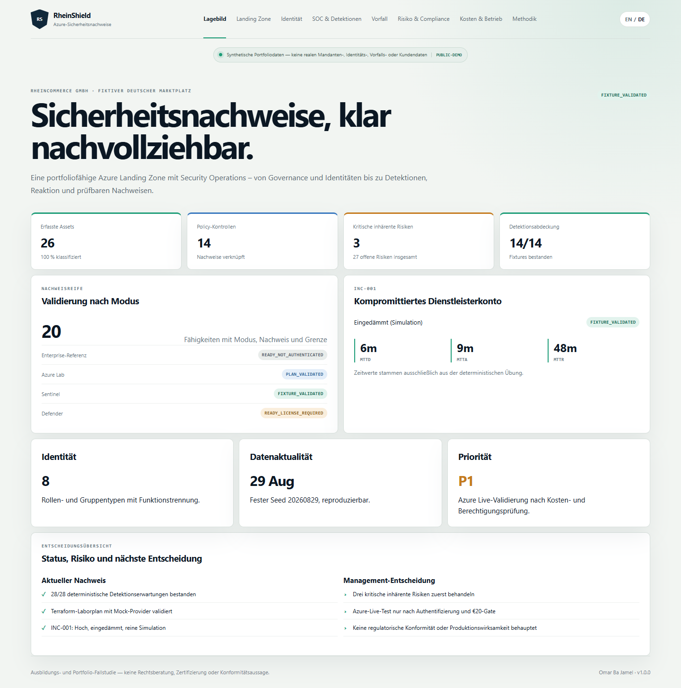

# RheinShield — Azure Landing Zone und Security Operations

[Live-Demo](https://omarbajamel.github.io/rheinshield-azure-cloud-security/) · [GitHub-Repository](https://github.com/OmarBajamel/rheinshield-azure-cloud-security) · [Release v1.0.0](https://github.com/OmarBajamel/rheinshield-azure-cloud-security/releases/tag/v1.0.0)

RheinShield ist eine zweisprachige, nachweisorientierte Portfolio-Fallstudie für eine sichere Azure Landing Zone. Sie verbindet Cloud Governance, Entra ID und Zero Trust, Microsoft Sentinel, Incident Response sowie NIS2-/ISO-/BSI-bezogene Nachweisführung.



**Wichtig:** RheinCommerce GmbH ist fiktiv. Alle öffentlichen Daten sind synthetisch. Das Projekt ist keine Rechtsberatung, Zertifizierung oder Aussage, dass ein Unternehmen NIS2-konform ist.

## Technischer Umfang

- Enterprise-Referenz auf Basis des offiziellen Azure-Landing-Zone-/AVM-Pfads sowie ein getrenntes, kostengeschütztes Ein-Subscription-Labor.
- Fünf Terraform-Module, 14 Policy-Kontrollen, Managed Identity, Key Vault RBAC, segmentiertes Netzwerk und zentrale Protokollierung.
- Acht Identitätsrollen, sechs Conditional-Access-Vorlagen im Report-only-Modell, PIM-/Access-Review-Konzept und GitHub OIDC ohne langfristiges Client Secret.
- 14 Sentinel Analytics Rules, fünf Hunting Queries, drei Workbooks, drei Automation Rules und drei deaktivierte Dry-Run-Playbooks.
- 738 reproduzierbare Ereignisse und die vollständige synthetische Untersuchung INC-001.
- 27 Risiken und 20 Evidenzkontrollen mit Zuordnung zu NIS2/BSIG, ISO/IEC 27001:2022, BSI IT-Grundschutz und MCSB v1.
- Acht responsive Dashboard-Seiten in natürlichem Englisch und Deutsch; Browser-, Accessibility- und Datenschutztests.

## Nachweisstatus

Die Enterprise-Referenz ist nach statischer Provider-Validierung `READY_NOT_AUTHENTICATED`; das zusammengesetzte Labor ist mit einem Terraform-Mock-Plan `PLAN_VALIDATED`. Sentinel-Inhalte und synthetische Daten sind `FIXTURE_VALIDATED`; Azure Live, Defender und Entra-Lizenzfunktionen bleiben transparent `READY_NOT_AUTHENTICATED` beziehungsweise `READY_LICENSE_REQUIRED`. Im Projektlauf wurden keine Azure-Ressourcen erstellt und keine Produktionswirkung behauptet.

## Schnellstart

```bash
npm ci
python -m pip install -e ".[dev]"
python tools/synthetic-telemetry/generate.py
npm run build
npm run start
```

Startseite: `http://127.0.0.1:4173/#/executive?lang=de`. Prüfpfade und Windows-/Linux-Skripte befinden sich in `Makefile` und `scripts/`.

Autor: **Omar Ba Jamel**
