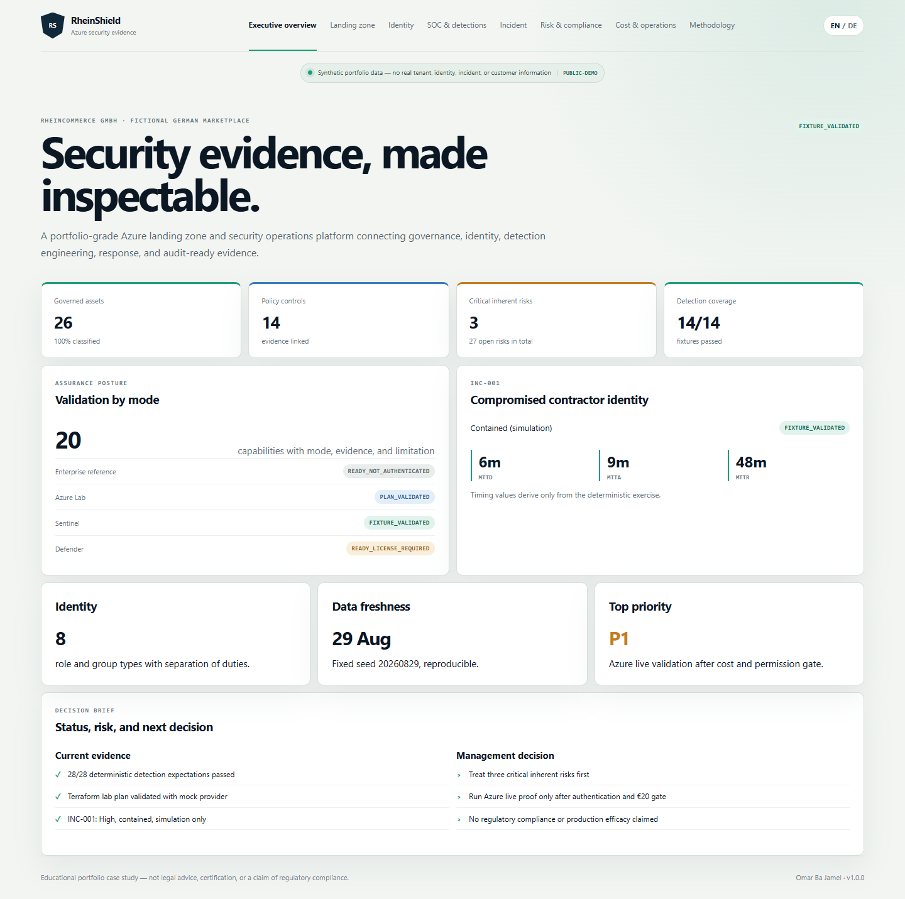
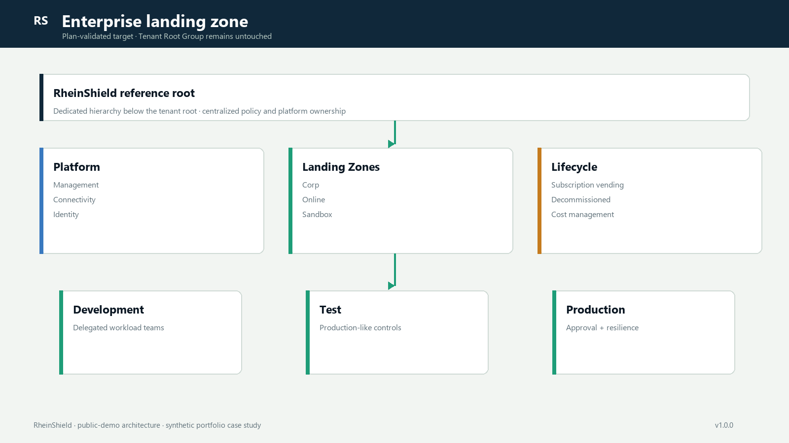

# RheinShield — NIS2-aligned Azure landing zone & security operations

> A bilingual, evidence-first Azure security portfolio connecting landing-zone governance, Zero Trust identity, Sentinel detection engineering, incident response, and German compliance expectations.

[Live demo](https://omarbajamel.github.io/rheinshield-azure-cloud-security/) · [v1.0.0 release](https://github.com/OmarBajamel/rheinshield-azure-cloud-security/releases/tag/v1.0.0) · [German summary](README.de.md)



**Synthetic portfolio data:** RheinCommerce GmbH is fictional. The public demo contains no real tenant, identity, incident, or customer information. This case study is not legal advice, a certification, or a claim that any organization is compliant.

## The problem

Cloud architecture, governance, security operations, and compliance evidence often live in separate documents and tools. RheinShield demonstrates one traceable engineering path: business services and risks drive controls; controls drive Terraform, identity, policy, KQL, and runbooks; deterministic tests and sanitized evidence support only the claims the project can prove.

## What was built

- A statically validated enterprise Azure Landing Zone reference using Azure Verified Modules, plus a mock-plan-validated single-subscription lab composed from five Terraform modules.
- A 14-control RheinShield Security Baseline, managed identity, Key Vault RBAC, segmented networking, central monitoring, and a hardened FastAPI workload.
- Eight Entra personas, six report-only Conditional Access definitions, PIM/access-review designs, JML workflow, and project-scoped GitHub OIDC.
- Fourteen Sentinel analytics rules, five hunts, three workbooks, three automation rules, and three disabled dry-run playbooks managed as code.
- A deterministic 738-event telemetry set and a complete INC-001 compromised-contractor exercise with MTTD 6m, MTTA 9m, and MTTR 48m—exercise metrics only.
- Twenty-seven risks and twenty evidence controls mapped across current German NIS2/BSIG expectations, ISO/IEC 27001:2022 control identifiers, BSI IT-Grundschutz, and stable MCSB v1.
- An accessible eight-page English/German dashboard, evidence sanitizer, privacy scanner, screenshot pipeline, and reproducible career/release package.

## Enterprise reference versus portfolio lab



| | Enterprise reference | Deployable lab |
|---|---|---|
| Scope | Dedicated management hierarchy and subscriptions | Three project resource groups in one subscription |
| Status | `READY_NOT_AUTHENTICATED` (static/provider validation passed; no authenticated plan) | `PLAN_VALIDATED` (mock plan; no live apply) |
| Governance | Central policy, logging, connectivity, identity | Teardown-safe audit/deny mix and mandatory expiry |
| Operations | Production resilience and delegated ownership | Minimal ingestion, scale-to-zero workload, €20 hard ceiling |

The project never modifies Tenant Root Group or existing Conditional Access. No Azure resource was created in this run because no authenticated Azure CLI context was available and the cost gate therefore blocked apply.

## Evidence at a glance

| Area | Result | Evidence |
|---|---|---|
| Terraform | 1.16.0 format, lab/enterprise/policy validate; native lab test 1/1 | [`terraform-validation.json`](artifacts/evidence/terraform-validation.json) |
| TFLint / IaC | TFLint 0.64.0: 0 issues; project security gate 14/14 | [`iac-security-scan.json`](artifacts/evidence/iac-security-scan.json) |
| Sentinel | 14/14 malicious fixtures triggered; 14/14 benign stayed quiet | [`detection-test-results.json`](artifacts/evidence/detection-test-results.json) |
| Public tooling | 9 Python tests; Ruff clean; MyPy clean on six source areas | [`TEST_REPORT.md`](docs/testing/TEST_REPORT.md) |
| Dashboard | 8 routes × 2 languages, mobile pass, 0 axe A/AA violations in 3 representative scans, 0 console errors | [`TEST_REPORT.md`](docs/testing/TEST_REPORT.md) |
| Privacy | Public pattern scan and screenshot privacy review pass | [`redaction-report.json`](artifacts/evidence/redaction-report.json) |

Validation terms are strict: `PLAN_VALIDATED`, `FIXTURE_VALIDATED`, `READY_NOT_AUTHENTICATED`, and `READY_LICENSE_REQUIRED` are not interchangeable with a live deployment. See the [capability matrix](docs/evidence/CAPABILITY_MATRIX.md).

## Architecture and security design

- [Architecture](docs/architecture/ARCHITECTURE.md) and [threat model](docs/architecture/THREAT_MODEL.md)
- [Network architecture](docs/architecture/NETWORK_ARCHITECTURE.md) and [lab/enterprise comparison](docs/architecture/LAB_VS_ENTERPRISE.md)
- [Zero Trust architecture](docs/identity/ZERO_TRUST_ARCHITECTURE.md) and [OIDC federation](docs/identity/OIDC_FEDERATION.md)
- [Policy baseline](docs/security/POLICY_BASELINE.md) and [security controls](docs/security/SECURITY_CONTROLS.md)
- [Detection catalog](docs/sentinel/DETECTION_CATALOG.md), [MITRE coverage](docs/sentinel/MITRE_COVERAGE.md), and [SOAR safety](docs/sentinel/SOAR_SAFETY.md)
- [INC-001 technical report](docs/incident-response/INC-001_TECHNICAL_REPORT.md)
- [German NIS2 applicability assessment](docs/compliance/NIS2_APPLICABILITY_ASSESSMENT_DE.md) and [risk register](docs/compliance/RISK_REGISTER.md)

## Quick start — no Azure account required

Prerequisites: Node.js 22+, Python 3.11+, and Chrome for browser tests.

```bash
npm ci
python -m pip install -e ".[dev]"
python tools/synthetic-telemetry/generate.py
npm run build
npm run start
```

Open `http://127.0.0.1:4173/#/executive?lang=en`. Other useful commands:

```bash
make validate        # lint, type, Sentinel, privacy
make test            # complete offline test/build gate
make screenshots     # real Chrome capture + manifest
make release-check   # public bundle and evidence gate
make clean           # remove reproducible local products
```

PowerShell and Bash equivalents are in `scripts/`. Azure commands are deliberately separate and require the [cost-safe deployment workflow](.agents/skills/azure-cost-safe-deploy/SKILL.md).

## Repository map

`infra/` Azure architecture and policy · `identity/` Entra definitions · `sentinel/` SIEM/SOAR content · `apps/` workload and dashboard · `tools/` generators/scanners · `docs/` engineering and compliance narrative · `artifacts/evidence/` machine results · `assets/` reviewed public visuals.

## Key engineering decisions

1. Enterprise management groups remain plan-only; the lab is independently scoped and destructible.
2. Terraform owns the platform; Bicep owns Sentinel resources where its API surface is clearer.
3. Public evidence is deterministic and offline-first; live exports can enter only through sanitization.
4. Expensive components are designed, not deployed merely for screenshots.
5. Legal applicability remains conditional; framework mapping is evidence navigation, not certification.

## Honest limitations

Azure, Defender for Cloud, Sentinel, Conditional Access, and PIM were not live-deployed in this run. The repository proves code structure, offline behavior, Terraform provider validation, deterministic detections, and release/privacy controls; it does not prove tenant behavior, production detection efficacy, business risk reduction, or regulatory conformity.

## Career relevance

The implementation is aligned to current German Azure, cloud-security, SOC/Sentinel, IAM, DevSecOps, and NIS2/ISO/BSI consulting vacancies. See the [job alignment study](docs/career/GERMANY_JOB_ALIGNMENT.md), [skills evidence](docs/career/SKILLS_EVIDENCE_MATRIX.md), and [interview story](docs/career/INTERVIEW_STAR.md).

Author: **Omar Ba Jamel** · License: [MIT](LICENSE)
